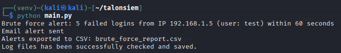

# TalonSIEM

A lightweight, terminal-based Security Information and Event Management (SIEM) tool.

**TalonSIEM** parses log files like `auth.log`, detects brute-force login attempts using regex, stores the data in SQLite, exports alerts to CSV, and sends real-time email alerts — all in a single Python script.

If you have any questions about TalonSIEM, or just want to connect, feel free to reach out:

- [LinkedIn](https://www.linkedin.com/in/antonio-del-campo/)

---

### Features

- Parses and processes Linux authentication logs
- Stores logs in a local SQLite database
- Detects brute-force login attacks (threshold + time window based)
- Real-time terminal alerts
- Email notifications via SMTP
- CSV export of detected brute-force alerts
- `.env`-based configuration for flexibility
- Aligned with NIST CSF

---

## Screenshot



---

## Usage

If you change the auth.log file and want TalonSIEM to scan the new log, you should delete the old database first:

```bash
rm talonsiem.db
```

This will let the program start fresh and create a new database with the new log entries.

## Installation

This is a Python-based project. To install and run it:

```bash
git clone https://github.com/YOUR_USERNAME/talonsiem.git
cd talonsiem
python3 -m venv venv
source venv/bin/activate         # Windows: .\venv\Scripts\activate
pip install -r requirements.txt
